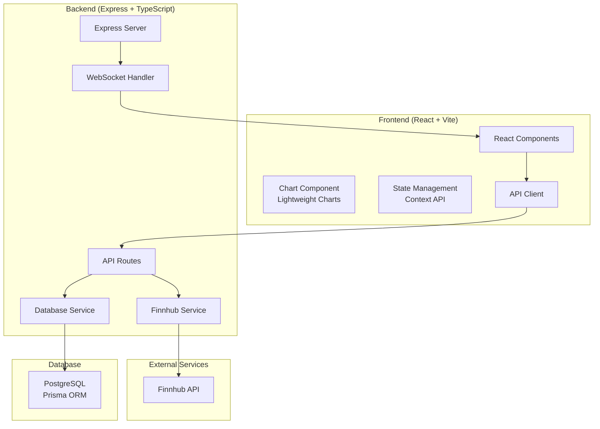

# Design Document

## Overview

TradingViewer is a modern web-based financial charting application built with a React frontend and Express backend. The application integrates with Finnhub API for real-time and historical market data, uses TradingView's Lightweight Charts library for visualization, and implements a PostgreSQL database for data caching and user preferences.

## Architecture

### System Architecture



### Technology Stack

- **Frontend**: React 18, TypeScript, Vite, TailwindCSS
- **Charts**: TradingView Lightweight Charts
- **Backend**: Express.js, TypeScript, Node.js
- **Database**: PostgreSQL with Prisma ORM
- **API Integration**: Finnhub API
- **Real-time**: WebSocket connections
- **Environment**: dotenv for configuration

## Components and Interfaces

### Frontend Components

#### Core Components

- `App.tsx` - Main application component with routing and global state
- `ChartContainer.tsx` - Main chart wrapper component
- `Chart.tsx` - Lightweight Charts integration component
- `SymbolSearch.tsx` - Financial instrument search interface
- `Toolbar.tsx` - Chart controls and settings
- `IndicatorPanel.tsx` - Technical indicators management
- `ThemeProvider.tsx` - Theme and styling management

#### Chart Components

- `CandlestickChart.tsx` - Candlestick chart implementation
- `LineChart.tsx` - Line chart implementation
- `VolumeChart.tsx` - Volume bars display
- `ChartControls.tsx` - Zoom, pan, and timeframe controls
- `PriceScale.tsx` - Price axis customization
- `TimeScale.tsx` - Time axis customization

#### UI Components

- `SearchInput.tsx` - Reusable search input component
- `Dropdown.tsx` - Dropdown menu component
- `Modal.tsx` - Modal dialog component
- `LoadingSpinner.tsx` - Loading indicator
- `ErrorBoundary.tsx` - Error handling wrapper

### Backend Services

#### API Layer

```typescript
interface APIRoutes {
  '/api/symbols/search': { query: string } => Symbol[]
  '/api/market/quote': { symbol: string } => Quote
  '/api/market/candles': { symbol: string, resolution: string, from: number, to: number } => Candle[]
  '/api/market/company': { symbol: string } => CompanyProfile
}
```

#### Service Layer

```typescript
interface FinnhubService {
  searchSymbols(query: string): Promise<Symbol[]>
  getQuote(symbol: string): Promise<Quote>
  getCandles(symbol: string, resolution: string, from: number, to: number): Promise<Candle[]>
  getCompanyProfile(symbol: string): Promise<CompanyProfile>
}

interface DatabaseService {
  cacheCandles(symbol: string, candles: Candle[]): Promise<void>
  getCachedCandles(symbol: string, from: number, to: number): Promise<Candle[]>
  saveUserPreferences(userId: string, preferences: UserPreferences): Promise<void>
}
```

## Data Models

### Database Schema (Prisma)

```prisma
model Symbol {
  id          String   @id @default(cuid())
  symbol      String   @unique
  description String
  displaySymbol String
  type        String
  createdAt   DateTime @default(now())
  updatedAt   DateTime @updatedAt
  candles     Candle[]

  @@map("symbols")
}

model Candle {
  id        String   @id @default(cuid())
  symbol    String
  timestamp BigInt
  open      Float
  high      Float
  low       Float
  close     Float
  volume    BigInt
  createdAt DateTime @default(now())

  symbolRef Symbol @relation(fields: [symbol], references: [symbol])

  @@unique([symbol, timestamp])
  @@index([symbol, timestamp])
  @@map("candles")
}

model UserPreferences {
  id          String @id @default(cuid())
  userId      String @unique
  theme       String @default("dark")
  chartType   String @default("candlestick")
  timeframe   String @default("1D")
  indicators  Json   @default("[]")
  createdAt   DateTime @default(now())
  updatedAt   DateTime @updatedAt

  @@map("user_preferences")
}
```

### TypeScript Interfaces

```typescript
interface Symbol {
  symbol: string
  description: string
  displaySymbol: string
  type: string
}

interface Quote {
  c: number // Current price
  d: number // Change
  dp: number // Percent change
  h: number // High price of the day
  l: number // Low price of the day
  o: number // Open price of the day
  pc: number // Previous close price
  t: number // Timestamp
}

interface Candle {
  c: number // Close price
  h: number // High price
  l: number // Low price
  o: number // Open price
  t: number // Timestamp
  v: number // Volume
}

interface ChartData {
  time: number
  open: number
  high: number
  low: number
  close: number
  volume?: number
}

interface TechnicalIndicator {
  id: string
  name: string
  type: 'overlay' | 'oscillator'
  parameters: Record<string, any>
  visible: boolean
}
```

## Error Handling

### Frontend Error Handling

- React Error Boundaries for component-level error catching
- Global error state management through Context API
- User-friendly error messages for API failures
- Retry mechanisms for failed requests
- Fallback UI components for degraded experiences

### Backend Error Handling

- Express error middleware for centralized error handling
- Finnhub API error mapping and user-friendly messages
- Database connection error handling with retry logic
- Rate limiting error responses
- Structured error logging with different severity levels

### Error Types

```typescript
enum ErrorType {
  NETWORK_ERROR = 'NETWORK_ERROR',
  API_RATE_LIMIT = 'API_RATE_LIMIT',
  INVALID_SYMBOL = 'INVALID_SYMBOL',
  DATA_NOT_FOUND = 'DATA_NOT_FOUND',
  DATABASE_ERROR = 'DATABASE_ERROR',
  AUTHENTICATION_ERROR = 'AUTHENTICATION_ERROR',
}

interface AppError {
  type: ErrorType
  message: string
  details?: any
  timestamp: number
}
```

## Testing Strategy

### ESM Configuration

The project uses ES Modules (ESM) throughout for modern JavaScript/TypeScript development:

- **Frontend**: Vite natively supports ESM with Jest configured for ESM
- **Backend**: Node.js with `"type": "module"` in package.json
- **Shared Packages**: ESM exports for cross-package compatibility
- **Test Files**: `.test.js` and `.test.ts` files using ESM imports/exports

### Frontend Testing (ESM)

- **Unit Tests**: Vitest (ESM-native) + React Testing Library for component testing
- **Integration Tests**: Testing component interactions and API calls with ESM imports
- **E2E Tests**: Playwright for full user journey testing
- **Visual Tests**: Screenshot comparison for chart rendering
- **Performance Tests**: Lighthouse CI for performance monitoring

### Backend Testing (ESM)

- **Unit Tests**: Vitest for service layer and utility functions with ESM
- **Integration Tests**: Supertest for API endpoint testing with ESM imports
- **Database Tests**: In-memory PostgreSQL for database operations
- **API Tests**: Mock Finnhub API responses for reliable testing
- **Load Tests**: Artillery.js for performance under load

### Test Configuration (ESM)

```typescript
// vitest.config.ts (Frontend)
export default defineConfig({
  test: {
    environment: 'jsdom',
    setupFiles: ['./src/test/setup.ts'],
    globals: true,
  },
  resolve: {
    alias: {
      '@': path.resolve(__dirname, './src'),
      '@shared': path.resolve(__dirname, '../packages/shared/src'),
    },
  },
})

// vitest.config.ts (Backend)
export default defineConfig({
  test: {
    environment: 'node',
    setupFiles: ['./src/test/setup.ts'],
    globals: true,
  },
  resolve: {
    alias: {
      '@': path.resolve(__dirname, './src'),
      '@shared': path.resolve(__dirname, '../packages/shared/src'),
    },
  },
})
```

### Test Coverage Goals

- Minimum 80% code coverage for critical paths
- 100% coverage for data transformation functions
- Integration tests for all API endpoints
- E2E tests for core user workflows

### Testing Environment

```typescript
// Test configuration with ESM
interface TestConfig {
  database: {
    url: string // Test database URL
    resetBetweenTests: boolean
  }
  api: {
    mockFinnhub: boolean
    rateLimitBypass: boolean
  }
  frontend: {
    mockWebSocket: boolean
    disableAnimations: boolean
  }
  esm: {
    moduleResolution: 'node16'
    allowSyntheticDefaultImports: true
  }
}
```

The design provides a scalable, maintainable architecture that efficiently integrates with Finnhub API while providing a smooth user experience through modern web technologies and proper error handling strategies.
