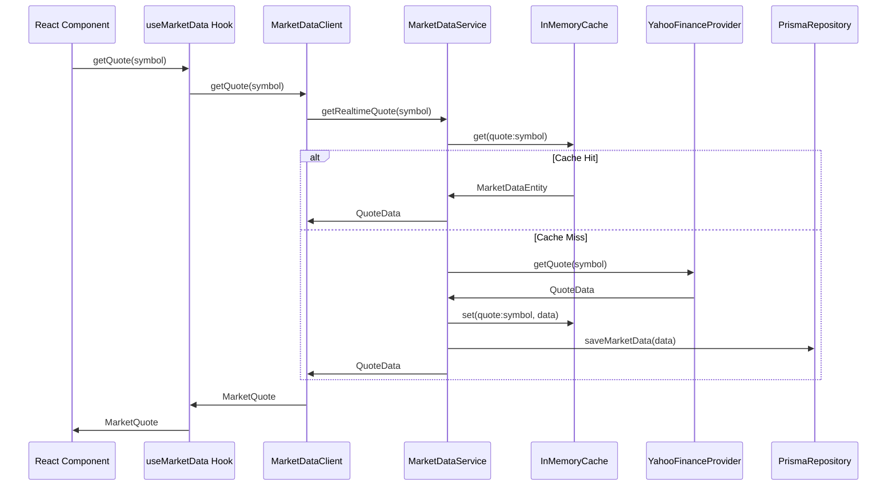
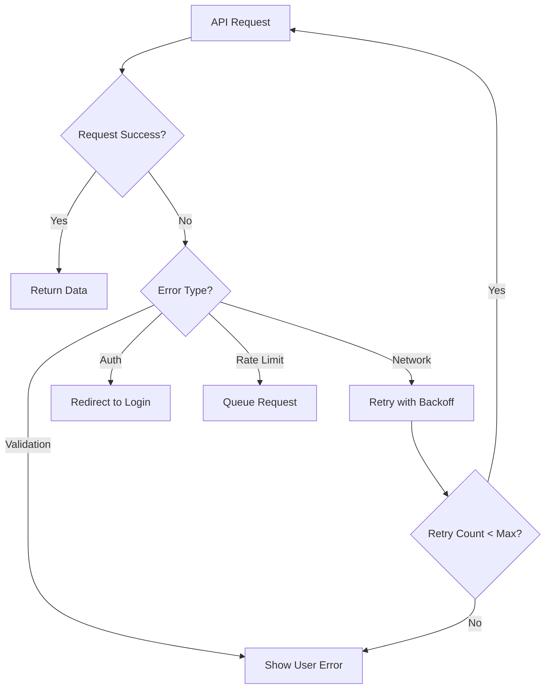

# TradingViewer アーキテクチャ設計書

## 概要

TradingViewer は Clean Architecture 原則に基づく多層アーキテクチャを採用しています。ビジネスロジックとインフラストラクチャの明確な分離により、保守性、テスタビリティ、拡張性を確保しています。

## 実装完了状況

### ✅ 完了済み機能

**ドメイン層**

- User, Symbol, Watchlist エンティティの実装
- リポジトリインターフェースの定義（IUserRepository, ISymbolRepository, IWatchlistRepository）
- イミュータブルなエンティティ設計と Factory パターン

**インフラストラクチャ層**

- Prisma ベースリポジトリ実装の完全移行
- トークン管理サービス（tokenStore, securityLogger）
- 外部依存サービスの適切な分離

**アプリケーション層**

- インディケーター計算サービス
- WebSocket リアルタイム通信サービス
- 認証・認可ミドルウェア

**動作検証済み**

- JWT 認証システム
- マーケットデータ API（Yahoo Finance 連携）
- チャート描画機能
- WebSocket リアルタイム更新
- 技術指標計算

## アーキテクチャ原則

### 1. 依存関係の方向性

```
UI → Application → Domain ← Infrastructure
```

- 外側の層は内側の層に依存する
- 内側の層は外側の層に依存しない
- ドメイン層は最も内側で、外部依存を持たない

### 2. レイヤー構成

#### Server 側アーキテクチャ

```
apps/server/src/
├── domain/                    # ドメイン層（コアビジネスロジック）
│   ├── entities/             # エンティティ（User, Symbol, Watchlist）
│   ├── repositories/         # リポジトリインターフェース
│   └── interfaces/           # ドメインサービスインターフェース
├── application/              # アプリケーション層
│   └── services/            # アプリケーションサービス（IndicatorCalculation 等）
├── infrastructure/           # インフラストラクチャ層
│   ├── di/                  # DI コンテナ
│   ├── providers/           # 外部 API プロバイダー
│   ├── services/            # 外部依存サービス（tokenStore, encryption 等）
│   ├── cache/               # キャッシュ実装
│   └── repositories/        # データアクセス実装（Prisma）
├── routes/                   # API ルート・コントローラー
└── middleware/              # ミドルウェア
```

#### Client 側アーキテクチャ

```
apps/client/src/
├── domain/                   # ドメイン層
│   └── interfaces/          # API クライアントインターフェース
├── infrastructure/          # インフラストラクチャ層
│   └── api/                 # API クライアント実装
├── components/              # UI コンポーネント
├── hooks/                   # React フック
├── services/                # アプリケーションサービス
└── lib/                     # ユーティリティ・レガシー API
```

## 主要コンポーネント

### Server 側

#### 1. ドメイン層

**MarketDataEntity**

```typescript
// 市場データの純粋なビジネスロジック
export class MarketDataEntity {
  constructor(
    public readonly symbol: string,
    public readonly priceData: PriceData,
    public readonly metadata: Metadata
  ) {}

  isStale(maxAgeInMinutes: number): boolean
  isReliable(minReliability: number): boolean
  getPriceChange(): { absolute: number; percentage: number }
  isValidPrice(): boolean
}
```

**MarketDataService**

```typescript
// ビジネスロジックの中核
export class MarketDataService implements IMarketDataService {
  constructor(
    private readonly marketDataProvider: IMarketDataProvider,
    private readonly marketDataCache: IMarketDataCache,
    private readonly marketDataRepository: IMarketDataRepository,
    private readonly dataQualityService: IDataQualityService
  ) {}

  async getRealtimeQuote(symbol: string): Promise<QuoteData>
  async getHistoricalData(
    symbol: string,
    from: Date,
    to: Date,
    interval: string
  ): Promise<MarketDataEntity[]>
}
```

#### 2. インフラストラクチャ層

**YahooFinanceProvider**

```typescript
// 外部 API との統合
export class YahooFinanceProvider implements IMarketDataProvider {
  async getQuote(symbol: string): Promise<QuoteData>
  async getHistoricalData(
    symbol: string,
    from: Date,
    to: Date,
    interval: string
  ): Promise<MarketDataEntity[]>
  async searchSymbols(query: string): Promise<TradingSymbolEntity[]>
}
```

**InMemoryMarketDataCache**

```typescript
// キャッシュレイヤー
export class InMemoryMarketDataCache implements IMarketDataCache {
  async get(key: string): Promise<MarketDataEntity | null>
  async set(key: string, data: MarketDataEntity, ttlInSeconds?: number): Promise<void>
  async invalidate(pattern: string): Promise<void>
}
```

**PrismaMarketDataRepository**

```typescript
// データ永続化
export class PrismaMarketDataRepository implements IMarketDataRepository {
  async saveMarketData(data: MarketDataEntity): Promise<void>
  async getMarketData(symbol: string, from: Date, to: Date): Promise<MarketDataEntity[]>
  async bulkSaveMarketData(data: MarketDataEntity[]): Promise<number>
}
```

### Client 側

#### 1. ドメインインターフェース

```typescript
export interface IMarketDataClient {
  getQuote(symbol: string): Promise<MarketQuote>
  getCandleData(params: CandleDataParams): Promise<CandleData[]>
  searchSymbols(query: string, limit?: number): Promise<SymbolSearchResult[]>
}

export interface ITradingViewerApiClient {
  market: IMarketDataClient
  watchlist: IWatchlistClient
  drawingTools: IDrawingToolsClient
  auth: IAuthClient
  appInfo: IAppInfoClient
}
```

#### 2. インフラストラクチャ実装

```typescript
export class TradingViewerApiClient implements ITradingViewerApiClient {
  public readonly market: IMarketDataClient
  public readonly watchlist: IWatchlistClient
  public readonly drawingTools: IDrawingToolsClient

  configure(config: ClientConfig): void
  isHealthy(): Promise<boolean>
}
```

## データフロー

### 1. 市場データ取得フロー



### 2. エラーハンドリングフロー



## 設計パターン

### 1. Repository Pattern

- データアクセスの抽象化
- ビジネスロジックからデータソースを分離
- テスト時のモック化が容易

### 2. Dependency Injection

- インターフェースベースの依存関係
- 実装の差し替えが容易
- 単体テストが簡素化

### 3. Factory Pattern

- オブジェクト生成の統一
- 設定管理の一元化

### 4. Observer Pattern

- リアルタイムデータ更新
- WebSocket 接続管理

## パフォーマンス最適化

### 1. キャッシュ戦略

**多層キャッシュ**

```
Browser Cache → InMemory Cache → Database → External API
```

**TTL 設定**

- リアルタイム相場: 1 分
- 検索結果: 30 分
- ニュース: 5 分
- 履歴データ: 1 日

### 2. データ取得最適化

- **Batch Request**: 複数シンボルの一括取得
- **Incremental Loading**: ページネーション対応
- **Background Refresh**: 見えないデータの事前更新

### 3. Bundle 最適化

- **Code Splitting**: ルート単位での分割
- **Tree Shaking**: 未使用コードの除去
- **Lazy Loading**: コンポーネントの遅延読み込み

## セキュリティ

### 1. 認証・認可

- JWT ベースの認証
- CSRF トークン保護
- Rate Limiting

### 2. データ検証

- 入力値のサニタイゼーション
- Zod によるスキーマ検証
- SQL インジェクション対策

## テスト戦略

### 1. 単体テスト

- ドメインロジックの完全カバレッジ
- インターフェースのモック化
- エッジケースの網羅

### 2. 統合テスト

- API エンドポイントテスト
- データベース操作テスト
- 外部サービス連携テスト

### 3. E2E テスト

- ユーザーシナリオの自動化
- クリティカルパスの検証
- パフォーマンス監視

## 移行戦略

### Phase 1: ドメイン層基盤構築 ✅

- ドメインエンティティの実装（User, Symbol, Watchlist）
- リポジトリインターフェースの定義
- Clean Architecture フォルダ構造の確立

### Phase 2: インフラストラクチャ分離完了 ✅

- 全サービス・リポジトリのレイヤー別移行完了
- Dependency Injection コンテナの実装
- インポートパス修正と動作検証完了

### Phase 3: 機能拡張

- 新機能の Clean Architecture 準拠実装
- パフォーマンス最適化
- 監視・ログ強化

## モニタリング

### 1. メトリクス

- API レスポンス時間
- エラー率
- キャッシュヒット率
- データベース接続プール状況

### 2. ログ

- 構造化ログ（JSON 形式）
- セキュリティイベント
- パフォーマンスメトリクス
- ビジネスイベント

### 3. アラート

- システムダウン
- 異常なエラー率上昇
- 外部 API 制限到達
- データベース接続エラー

## 今後の展望

### 1. マイクロサービス化

- ドメイン境界での分割
- 独立したデプロイメント
- サービス間通信の最適化

### 2. イベント駆動アーキテクチャ

- 非同期メッセージング
- イベントソーシング
- CQRS パターン

### 3. 分散キャッシュ

- Redis クラスター
- CDN 活用
- エッジコンピューティング

---

この設計書は進化するドキュメントです。アーキテクチャの変更に合わせて継続的に更新してください。
